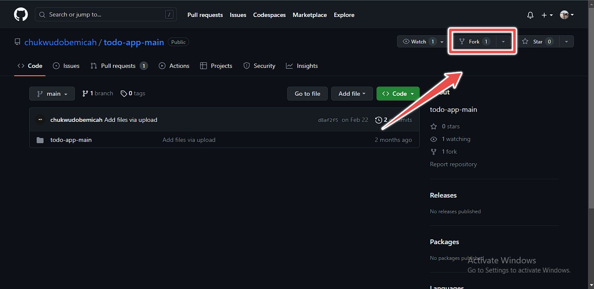
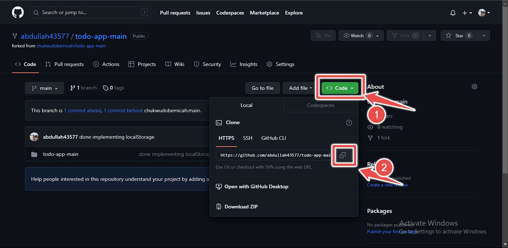

# TaskDeck - Todo Application

This is an open source full-stack application for managing tasks and to-do lists. The application is built with a modern tech stack that includes React on the frontend and Node.js on the backend. The project is designed to be modular, extensible, and easy to use, so that developers can easily contribute and build upon the existing codebase.

Features:

- Create, update, and delete tasks
- Organize tasks by categories or tags
- Set due dates and reminders
- View analytics and statistics on completed tasks

This project is currently in development, and contributions from developers of all levels are welcome. Whether you're a seasoned pro or just starting out, there's something for everyone to work on. So come join us and help build the next generation of task management software!

## Table of Contents

- [Features](#features)
- [Technologies](#technologies)
- [Usage](#usage)
- [Contributing](#contributing)
- [License](#license)

## Features

Features:

- Create, update, and delete tasks
- Organize tasks by categories or tags
- Set due dates and reminders
- View analytics and statistics on completed tasks

## Technologies

The technologies to be used building this are:

- HTML
- CSS / SASS / SCSS
- REACT

We will most definitely be updating this techonlogies section based on whatever requirements or tools are needed to achieve a particular goal

## Contributing

Follow this Guideline to contribute to this project

<h1 align="center">How To Contribute</h1>

<h2>1. Install Git and Configure it `If you've installed git please skip this step`</h2>

here's a youtube tutorial to guide you through installing git properly

I recommend you watch this if you haven't installed git.

---

 
<h2>2. Fork this repository and Pull or clone the repo locally.</h2>
 

Fork the repository to your own GitHub account by clicking the "Fork" button on the repository page.

Cloning a project means bringing the project to your local Machine. To clone this project, click the button on green that says code and on the drop down box, copy the URL of the project in the box and open up your git bash terminal and type in the following command `git clone "URL you just copied`
It should look like this:

`git clone https://github.com/yourAccountName/TaskDeck.git`

`yourAccountName` would be your username on github. By defualt this should be automatically be pre-populated for you, all you just need to do is to copy it and clone it in your local machine.

---

 
<h2>3. Switch directory into the cloned project</h2>
 

Next switch into the folder of the repo we just cloned by typing this command in your bash terminal:

`cd <repository name>`

so in this case it would be
`cd TaskDeck/` just as shown below

.jpeg>)

Following the above process would switch you into a directory called `TaskDeck`

---

 
<h2>4. Point upstream to origin branch</h2>
 

you then point the origin branch you want to push to to git using:

`git remote add upstream https://github.com/yourAccountName/TaskDeck.git`

where `yourAccountName` is your github username, once again this would be filled automatically when you're doing yours.

---

 
<h2>5. Create branch</h2>
 

Now we have successfully pointed our origin repo to upstream, we can now create a new branch which we'll be making our changes from. To create a branch, type the command:

`git checkout -b <branch name>`

You can name the branch anything you want, E.g `git checkout -b main`

---

 
<h2>6. Make your changes</h2>
 

At this step, you would have finished making all the changes you needed done in the code you downloaded locally on your system.

---

 
<h2>7. Make Commit `save the file`</h2>
 

since we are now done making changes to the file we run this code

- `git status`

running the above code would show in the terminal all the files you made changes to.

- `git add .` or `git add -A`

this would now add files ready to be deployed to github, but before we deploy any file to github we need to explain what the deploy does, so that leads to the next step which is,

- `git commit -m "your message here"`

here you'd run this code with the message you want to be shown, `this message should explain what you fixed or what code you changed in the code`

so Ideally you might want to run something like `git commit -m "first commit"` or `git commit -m "fixed a bug"` e.t.c.

running the commit command will automatically save your code and it's ready to be shipped or deployed back to github.

---

 
<h2>8. Push changes back to Github</h2>
 

To deploy your code back to GitHub you run

`git push origin <branch name>`

so with this example we've been following along it would be something along the line of

`git push origin main` or anything you named your branch in particular.

the changes should get pushed to the main repository (for this example) and we can now do a pull request.

---

 
<h2>9. Make a Pull Request</h2>
 

Now when you check the repo your forked, you should see the changes we just pushed to GitHub

## Usage

Instructions on how to use your project.

## License

Include information on the license for your project.
